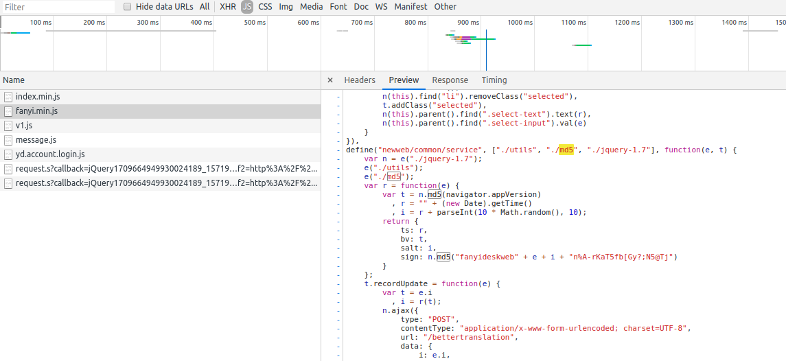

# youdao api

Chrome 中随意查看请求能大致构造这样的请求：

    curl -X POST \
      'http://fanyi.youdao.com/translate_o?smartresult=dict,rule' \
      -H 'Accept: */*' \
      -H 'Accept-Encoding: gzip, deflate' \
      -H 'Cache-Control: no-cache' \
      -H 'Connection: keep-alive' \
      -H 'Content-Length: 372' \
      -H 'Content-Type: application/json; charset=utf-8' \
      -H 'Host: fanyi.youdao.com' \
      -d '{
        "i": "Spanish Translation for all three seemed good",
        "from": "AUTO",
        "to": "AUTO",
        "smartresult": "dict",
        "client": "fanyideskweb",
        "salt": "15719132545241",
        "sign": "8c35e4169b3e331cbe18f27baac2be37",
        "ts": "1571913254524",
        "bv": "e2baf4b7602e0ecc32bd1350facecf0b",
        "doctype": "json",
        "version": "2.1",
        "keyfrom": "fanyi.web",
        "action": "FY_BY_REALTIME"
    }'
    
分析请求参数：

参数     | 说明
--------|-------
i       | 很容易猜测是”待翻译内容”
from    | 来源语言代码
to    | 目标语言代码
smartresult    | 固定为 "dict"
client    | 固定为 "fanyideskweb"
doctype    | 固定为 "json"
version    | 固定为 "2.1"
keyfrom    | 固定为 "fanyi.web"
action    | 固定为 "FY_BY_REALTIME"
ts    | 看起来像时间戳，待会儿验证
bv    | 看起来像是某个值 MD5
salt    | 像是某加密算法 salt
sign    | 看起来像是 MD5

在 Chrome 审查工具中，查看这次请求发起的 JS，在 `Network` 下，找 `Initiator`，或者找到对应的 JS 代码

这里能看到这样一段代码

    define("newweb/common/service", ["./utils", "./md5", "./jquery-1.7"], function(e, t) {
        var n = e("./jquery-1.7");
        e("./utils");
        e("./md5");
        var r = function(e) {
            var t = n.md5(navigator.appVersion)
              , r = "" + (new Date).getTime()
              , i = r + parseInt(10 * Math.random(), 10);
            return {
                ts: r,
                bv: t,
                salt: i,
                sign: n.md5("fanyideskweb" + e + i + "n%A-rKaT5fb[Gy?;N5@Tj")
            }
        };

分析一下:

- ts 就是时间戳
- bv 是 n.md5(navigator.appVersion)
- salt 是当前时间戳加上 0 到 10 的随机数 `r + parseInt(10 * Math.random(), 10)`
- sign 是 `n.md5("fanyideskweb" + e + i + "n%A-rKaT5fb[Gy?;N5@Tj")` 也就是固定字符 + e + salt + 固定字符的 MD5

到这里，可能还不清楚这个 e 的含义，那么来看一下官方的[文档](http://ai.youdao.com/DOCSIRMA/html/%E8%87%AA%E7%84%B6%E8%AF%AD%E8%A8%80%E7%BF%BB%E8%AF%91/API%E6%96%87%E6%A1%A3/%E6%96%87%E6%9C%AC%E7%BF%BB%E8%AF%91%E6%9C%8D%E5%8A%A1/%E6%96%87%E6%9C%AC%E7%BF%BB%E8%AF%91%E6%9C%8D%E5%8A%A1-API%E6%96%87%E6%A1%A3.html)

在 sign 一行他是这么写的：

>    sha256(应用ID+input+salt+curtime+应用密钥)

那么我们不妨猜测一下上面的 e 就是输入内容。尝试一下果不其然。

